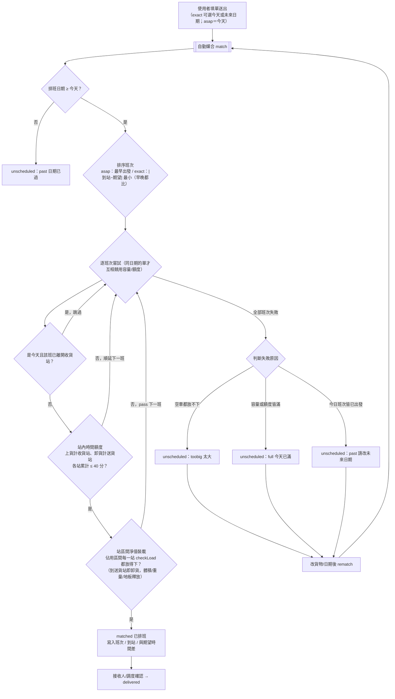
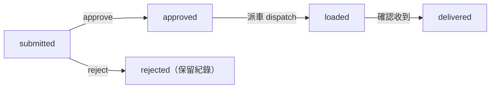
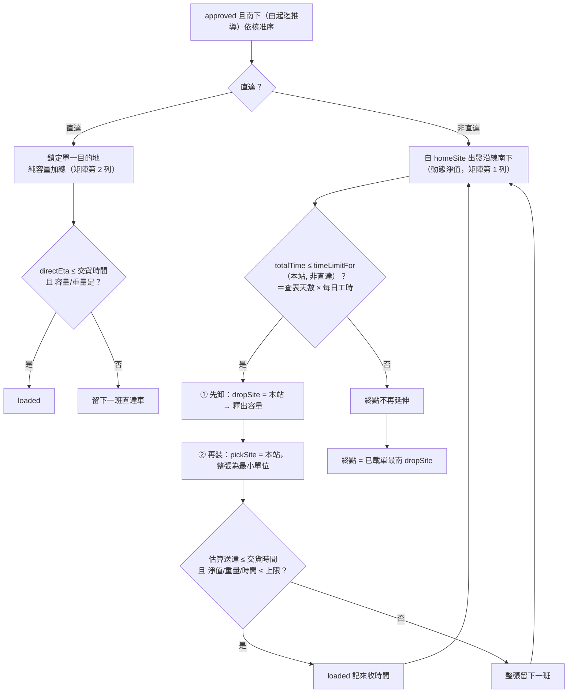
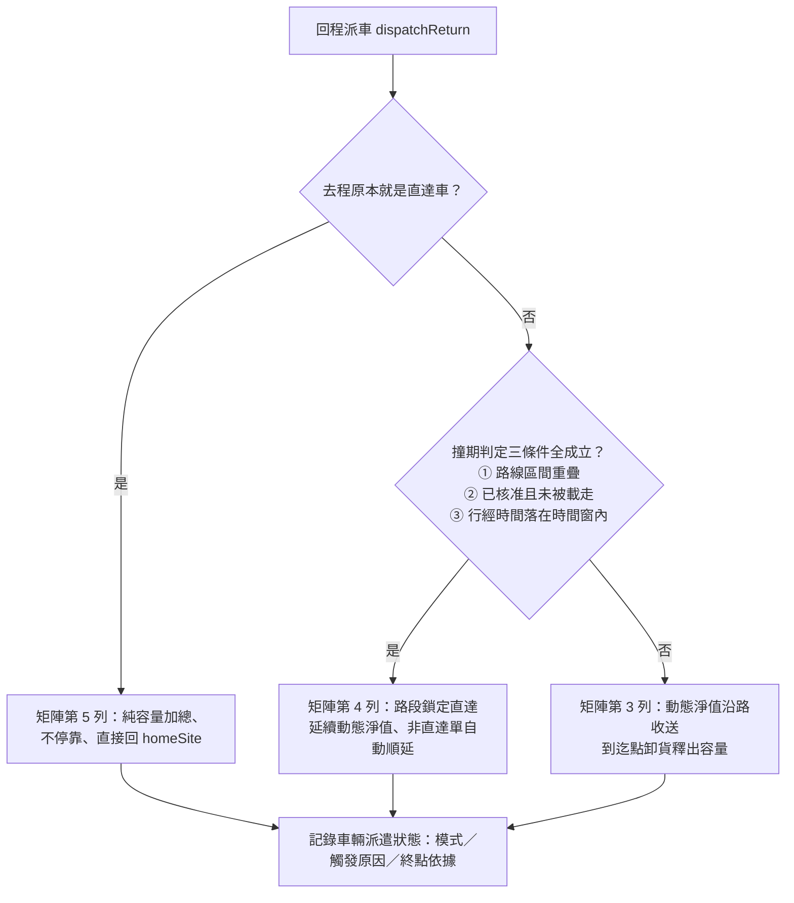
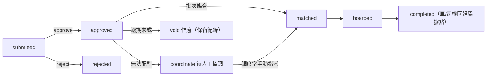
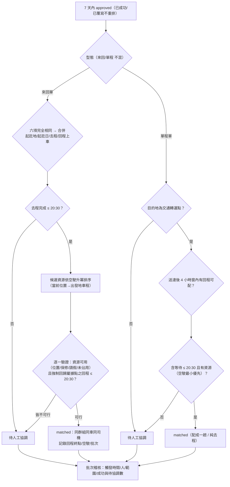

# 系統邏輯彙整（依現行程式碼）

> 本文件依 `js/` 下實際程式碼整理，說明三個模組的**流程（申請→審核→媒合→結案）**與**中間媒合邏輯與條件**。
> 對象檔案：`data.js`(主檔)、`loadengine.js`(共用裝載引擎)、`moduleA.js`、`moduleB.js`、`moduleC.js`、`app.js`(介面控制)。
> 註：數值多為示意（天數表、車程、係數、額度），待業務盤點，不可直接上線。

---

## 〇、共用裝載判定引擎（`loadengine.js`）— A、B 皆引用

### 類別浪費係數 `WasteFactorProvider`
- 由 `DB.wasteFactors` 建快取（static 單例）；查無類別 → 回**保底值** `DB.wasteDefault = 1.30`，不擲例外。
- 係數示意：標準紙箱 1.10、棧板貨 1.20、長條/管材 1.45、不規則件 1.65、桶裝/圓形 1.35、易碎/需空隙 1.55。

### 單品有效值 `itemEffective(it)`
- 體積 `vol = l×w×h / 1000`（公升）。
- **形狀懲罰** `shapePenalty`：長寬比（最長邊/最短邊）> 3 → ×1.10；> 2 → ×1.05；否則 ×1.0。
- **有效體積** `eff = vol × 類別係數 × 形狀懲罰 × 數量`。
- **地板投影** `floor = 次長邊 × 最短邊 × 數量`。
- **重量** `weight = 單件重 × 數量`。

### 主判定 `checkLoad(items, vehicle, startLoad)`
四道關卡，**任一不過即失敗**並回原因碼；`startLoad` 為車上既有負載（逐站累計用）：

| 關卡 | 條件 | 原因碼 |
|---|---|---|
| Level 1 有效體積 | `既有體積 + Σeff ≤ 車輛容量(L)` | `L1_VOLUME` |
| 地板面積瓶頸 | `Σfloor ≤ 車廂地板(車長×車寬)` | `FLOOR` |
| Level 2 維度 | 每件皆能以**六方向旋轉**放進車廂 `(l,w,h)` | `L2_DIM` |
| 重量累計 | `既有重量 + Σweight ≤ 車輛載重上限(kg)` | `WEIGHT` |

> A 模組用**完整 `checkLoad`**（含 Level 2 六方向）。B 模組只用 **Level 1 有效體積 + 重量**（`effVolume`），不做 Level 2 維度檢查。

---

## 一、區域內物流（模組 A，`moduleA.js`）

固定 10 站路線、每日人工排定班次、**送出即自動媒合**（無主管核准）。

### 軟體單元
- A｜收貨申請（使用者）：填單、送出即媒合、查看結果、確認交貨。
- A｜車次追蹤（業務）：追蹤已排定車次、路線班次、駕駛異常回報。
- A｜司機任務單（駕駛）：以班次（車輛）為單位的沿線收送任務。

### 狀態流轉
```
submitted ──(送出即自動媒合)──▶ matched ──(接收人/調度確認)──▶ delivered
              └───────────────▶ unscheduled（未排入，可改貨物後 rematch 重試）
```
- **無「主管核准」「業務媒合按鈕」「確認接受排班」**；媒合成功即完成排班，可由 matched 直接交貨。

### 申請單主要欄位（`createApp`）
- `pickStation`(收貨站/起) + `pickupLoc`、`station`(送貨站/迄) + `building`、`recipient`(接收人：單位/姓名/電話/代理人)。
- `deliverTime`(**期望收貨時間**，僅 `exact` 模式用於挑班次，**非硬性截止**)、`expectDiffMin`(排定到站與期望的差，僅供顯示)。
- `serviceDate`(**排班日期**)：`exact` 可指定今天或未來日期（表單 `min` 擋過去）；`asap` 即當天。
- `items[]`(逐件尺寸/類別/數量/重量)、`recvMode`(`asap` 越快越好 / `exact` 指定期望時間)。
- `loadMin`+`unloadMin` = `handleMin`（站內佔用時間）、`submitSeq`(送出序，決定同站處理先後)。

### 媒合演算法 `match(app)`
主檔：**每日 5 個班次** `regionalShifts`（08:00、10:30、13:00、15:00、17:00），兩台車輪替。
- **到站時間** = 班次出發時間 + `站序 × 12 分`（示意）。
- **「現在」可注入**：`ModuleA.now()` 預設回傳系統時間，測試可覆寫以確保結果可重現。

**Step 0 日期與時間界線**
- `date = serviceDate`（預設今天）。若 `date < 今天` → 直接回 `past`（日期已過）。
- `date` 是今天 → 界線 `cutoff = 現在時間`；未來日期 → 不設界線（全日班次皆可）。
- **容量與站內額度僅在「同一 `serviceDate`」的單之間競用**——不同日期各自獨立計算。

**Step 1 班次排序（依收貨模式）**
- `exact` 且有期望收貨時間 → 依 `|到站 − 期望時間|` 最小排序（**早晚都比**）。
- `asap`（越快越好）→ 依**最早出發時間**排序。
> 期望時間**只影響挑選順序**，不會因「來不及」而退件（規格 4.1）。

**Step 2 佔用站區間（先卸後裝 3.4/3.5）**
每張單佔用 `[收貨站序, 送貨站序)`；抵達送貨站即卸貨，**有效體積、重量、地板投影同步釋放**。
未帶收貨站者視為自路線起點載運（相容）。

**Step 3 逐班次嘗試（時間軸最近的下一班）**
0. **今日已過班次不採計**：車輛抵達**收貨站**的時間 `≤ cutoff` → 該班已離開、無法上貨，跳過。
1. **太大偵測**：空車 `checkLoad` 若放得下，標記 `fitsSomeEmpty`（用於區分「太大」）。
2. **站內時間額度**（`STATION_QUOTA = 40 分`）：**上貨計收貨站、卸貨計送貨站**，各站各自累計；任一站超額 → **順延下一班**。
3. **裝載判定（站區間淨值）**：對佔用區間內**每一站**，取該站車上淨負載（僅計佔用區間涵蓋該站者）為 `startLoad`，跑 `checkLoad`；
   - 每站都放得下 → `matched`，寫入 `assignedShift`、`arrival`、`expectDiffMin`。
   - 任一站放不下 → pass 下一班。

**Step 4 全部班次皆失敗 → 分三種原因（不留候補、不排隔日）**

| 情況 | `reason` | 訊息 |
|---|---|---|
| 指定日期早於今天，或今日班次皆已出發 | `past` | 日期已過／今日班次已過，請改指定未來日期 |
| 任一空車都放不下 | `toobig` | 貨物太大，超過任何車輛尺寸/容量 |
| 放得下但各班次容量/站內額度皆滿 | `full` | 今天已滿，請改期 |

> 已**移除** `late` 原因碼：期望時間不再作為成敗依據，只回報 `expectDiffMin`（「較期望時間晚 X 分」）供前端提示。

- **重新媒合** `rematch(app)`：未媒合單編輯貨物後清空舊排班重跑一次。

### 司機任務單
依 **`serviceDate` ＋ `assignedShift`** 分組，每個「日期＋班次（車輛）」一張任務單（不同日期不混在同一張）：依**送貨站順序**列出各交貨點的收貨地點（起）、送貨站（迄）、預計到站、貨物、接收人、交貨狀態。

---

## 二、南北幹線（模組 B，`moduleB.js`）

10 據點南北一直線（D1 屏東 … D10 台北），**基地（出發據點）為 D9 桃園龍潭**（中段位置，走主檔 `homeSite`）；
需**主管准駁**後才進派車池；業務派車採貪婪/直達分流與動態淨值。

### 軟體單元
- B｜幹線託運申請（使用者）、B｜主管准駁（主管）、B｜派車調度（業務）、B｜司機任務單（駕駛）。

### 狀態流轉
```
submitted ──(approve)──▶ approved ──(派車)──▶ loaded ──(確認收到)──▶ delivered
        └──(reject)───▶ rejected（保留紀錄，不進派車池）
```
> 已**移除** `accepted`（接收人確認接受）中間步驟：派車後 `loaded` 可直接進 `delivered`。

### 託運單主要欄位（`createOrder`）
- `pickSite`(收貨據點/起)、`dropSite`(送貨據點/迄)。**無 `leg` 欄位**——行程方向由起迄相對順序推導（`isSouthbound`：迄點較南＝南下，較北＝北上），不由申請人勾選。
- `pickupLoc`/`deliverLoc`(建物)、`deliverTime`(交貨時間)、`recipient`(接收人)、`direct`(直達與否)。
- `items[]`(逐件尺寸)、`loadMin`+`unloadMin` = `handleMin`。
- `recompute`：由 items 加總 → `volume`(申報貨量)、`weight`、`effVol`(**有效體積**，容量計算基準)。

### 主管准駁
- `approve(o, note)`：填 `approvedAt`（核准序，供派車排序）；`reject(o, note)`：不進池、保留備註。
- 審核以「是否同意（是/否）＋審核備註（駁回必填）」記錄。

### 時間模型（2.9 / 2.12 / 2.13 / 2.14）
- **行駛時間查表**：`DB.siteTravel` 據點相互路程表（含龍潭/屏東/高雄休息會館），`travelMin(a,b)`；**不再用單一常數×段數**。
- **每日在勤上限 12.5 小時**（`dailyDutyMin`），自表定上班 `08:00` 起算，涵蓋：出勤前緩衝 → 行駛 → 休息用餐 → 裝卸 → 收工緩衝＋**返回休息地**（查表取最近會館）。
- **司機休息用餐**：依**純累積行駛時間**觸發 >3h/30、>4h/60、>6h/30、>8h/30、>10h/30 分；共用不歸零時數線，計入在勤但不推進行駛線；**每日出勤歸零**。
- **跨夜**：當日額度不足即過夜，隔日在勤與行駛時數線同時歸零；達 `maxTripDays` 才停止延伸。
- **媒合截止**：派車日前 2 天 12:00；逾時不接受插單，自動標記順延至下一可媒合車次。

### 派車主檔常數
- **出發（基地）據點 `DB.homeSite = 'D9'`（桃園龍潭）**：主檔參數，不寫死；去/回程方向與行經序列由其在南北順序中的位置推算。
- **可服務範圍 `isServable(o)`＝基地及其以南**：現行車次模型為「自基地南下 → 折返北上回基地」，故**基地以北據點（D10 台北）不在任何路線上**。涉及北側據點的託運單**一律不排入**，並於派車 trace 與待派清單明確標示原因（北側排班方式為 TODO B-2，**待業務確認**），避免載走卻無法卸貨。
- **時間上限＝每日 12.5 小時在勤額度**（見上「時間模型」）。**天數表不參與運算**（3.1）：`minTripDaysFor(車輛, 終點)` 依「車型 × 目的地」查表，僅作排班參考顯示；精算天數超出表定值時**以精算為準照常派車**，僅提醒調度員。
- 容量基準＝**有效體積 `effVol`**（Level 1 + 形狀，不做 Level 2）＋重量。

### 去程派車 `dispatch(vehicleId, mode, dispatchDate)`
僅處理 `approved` 且**南下**（由起迄推導）的單，依 `approvedAt` 排序；帶 `dispatchDate` 時先套用 **2.14 媒合截止**（逾時者標記順延、不排入）。

**直達的兩種來源（3.2）**：`direct` 欄位＝**急件直達**（申請人指定，觸發獨立派車與回程鎖定）；**自然直達**＝時間不足導致未停靠，僅為排程結果（`naturalDirect` 旗標），**不觸發任何分流**。

**(A) 急件直達 `direct`（G38/G39）**
- 取**最早核准直達單**的 `dropSite` 為單一目的地，只服務同 `dropSite` 的直達單。
- **純容量加總**（不跑貪婪）：`載入量+eff ≤ 車容量` 且 `重量+weight ≤ 車重` → 載入；超量留下一班。
- 抵達目的地 `directEta = 表定 08:00 + 前置緩衝 + travelMin(出發, 目的地)`（查路程表）。
- **交貨時間門檻**：`directEta > 交貨時間` → 該單留下一班直達車。

**(B) 非直達貪婪 + 動態淨值（G32/G33/G34/G35）**
自 `homeSite` 出發（基地本身即可上貨），沿 `southboundFrom(homeSite)` 逐據點：
1. **行駛**：查路程表；當日額度不足 → 跨夜（隔日歸零），已達最大天數才**停止延伸**。
   > 2.3：**容量觸頂只跳過該張表單、車輛續行**；只有時間觸頂才停止延伸。
2. **先卸貨**：車上以本站為 `dropSite` 者卸下 → 釋出容量（`netVol -= eff`），裝卸時間計入當日在勤。
3. **再裝貨**：本站為 `pickSite` 的 approved 單，依核准序，**整張表單為最小單位**：
   - **交貨時間門檻（2.11）**：估算送達 `estDrop = 表定 08:00 + 當日在勤 + loadMin + travelMin(本站, dropSite)`；`> 交貨時間` → 留下一班。
   - **容量/時間**：`netVol+eff ≤ 車容量` 且 `netWt+weight ≤ 車重` 且 `loadMin ≤ 當日剩餘在勤額度` → 裝入(`loaded`)，記 `pickupTime`；否則整張跳過（留下一班），**車輛續行**。
4. 記錄**峰值淨值** `peakVol`；終點取所有已載單 `dropSite` 之**最南者**。
5. 回程抵達終點（基地）時，卸下以基地為送貨據點者並記錄卸貨時間。

### 五列決策矩陣 `DECISION_MATRIX`（3.7 · G44）
派車模式由**單一決策表**驅動（非散落於各分支），亦為調度室顯示的資料來源：

| # | 情境 | 容量計算 | 終點 | 中途停靠 |
|---|---|---|---|---|
| 1 | 去程・非直達 | 動態淨值（2.4） | 貪婪法自動判斷（2.3） | 逐站收送非直達貨 |
| 2 | 去程・直達 | 純容量加總（3.3） | 申請單目的地 | 不停靠 |
| 3 | 回程・非直達且無撞期 | 動態淨值 | 出發據點（2.7） | 逐站收送非直達貨 |
| 4 | 回程・被迫鎖定直達 | 動態淨值（延續，3.6） | 出發據點（3.6） | 不收新非直達貨，仍依序經過 |
| 5 | 回程・原本就是直達車 | 純容量加總 | 出發據點 | 不停靠 |

### 回程派車 `dispatchReturn(...)`（全域直達鎖定 G40–G43）
- 回程終點固定回 `homeSite`。
- **撞期判定 `collidesReturnDirect(o, 折返點)` 三條件**（全部成立才鎖定）：
  1. **路線**：直達單起訖區間與回程車實際行經區間**重疊**。
  2. **狀態**：該直達單已核准、尚未被任何車次載走（呼叫端以 `approved` 過濾）。
  3. **時間**：回程車行經該單上車據點的預估時間，落在其可派時間窗內——有交貨時間者需 `行經時間 ≤ 交貨時間 + directLockWindowMin`；未指定＝整日可派。**窗寬走主檔，待業務確認**。
- 判定通過 → 路段鎖定直達（第 4 列）；被排擠的非直達單走自動順延（G42）。

### 車輛派遣狀態 `vehicleStatus`（3.8）
每次派車記錄該車：**目前模式**（矩陣五列之一）、**觸發原因**（例：「當天有直達申請單（最早核准 LB004）→ 獨立派車」）、**終點與判定依據**（已載單最南送貨據點／申請單指定目的地／出發據點），供調度室一眼覆核。

### 司機任務單
依 `dispatchVehicle` 分組；把每張單的收貨（`pickSite`）、送貨（`dropSite`）展開為**停靠序**，各據點顯示要「取貨／卸貨」哪些單、收/送地點與接收人。

---

## 三、差旅共乘（模組 C，`moduleC.js`）

商務用車共乘，資源池（車/司機）與 A、B **完全分開**；需主管准駁後由業務**批次媒合**。

### 軟體單元
- C｜出差用車申請（使用者）、C｜主管准駁（主管）、C｜媒合調度（業務）、C｜司機任務單（駕駛）。

### 狀態流轉
```
submitted ──(approve)──▶ approved ──(批次媒合)──▶ matched ──▶ boarded ──▶ completed
        └──(reject)───▶ rejected                 └──▶ coordinate（待人工協調）
                                                  逾期未成 ──▶ void（作廢，保留紀錄）
```

### 申請單主要欄位（`createApp`）
- `type`(`round` 來回 / `oneway` 單程)、`origin`/`dest`、`departDate`/`earliestPickup`、`returnDate`/`earliestReturn`、`pax`(人數)。
- 車程 `travelMin = bizTravel[起|迄] + bizBuffer(15)`（車程表**對稱**，查無正向則查反向）；`latestArrival` 最晚抵達為**唯讀參考，不參與媒合**。

### 歸屬據點與當前位置（v4 語意區分）
- **`homeSite` 歸屬據點**：行政/資產管理上固定隸屬（保養、常駐、鑰匙管理），**不因單次出差改變**。
- **`currentSite` 當前位置**：排班可用性判斷依據（G59）。無進行中多天任務時兩者相同；行程完成 `completeTrip` 後 `currentSite` **回復** `homeSite`。

### 資源可用性檢核 `findResourceCandidates`（G59/G60/G61 + 空駛最小化）
於商務池（`seats ≥ pax`）中找可用車 + 司機：
- **G59 當前位置**：出發地對應據點 `bizOriginSite` 須等於車/司機 `currentSite`（主檔 `allowCrossSiteDeadhead=true` 時改為允許跨據點調度，**待業務確認**）。
- **G60 車輛保修**：`maintenance` 期間內排除該車。
- **G61 司機請假**：`driverLeaves` 時段重疊排除該司機。
- **同車/同司機同日**不重複指派（`occupied` 表跨批次/群組共用）。
- **空車移動最小化（最高優化目標）**：空駛 `deadheadMin` ＝查主檔路程表 `siteTravel[當前位置|出發地據點]`（與幹線共用同一張表 2.9）；候選清單依**空駛總和升冪排序**，取第一個可行者 → 空駛最小優先、車次數次要。**取捨權重待業務確認**。

### 批次媒合 `runBatch(fromDate)`（按鈕觸發）
處理 `fromDate` 起 **7 天內**、`approved` 的單；**已成功單不重排**（G53）；兩型態**不互相混合**（G50）：

**來回單（G54）**
- 六項**完全相同**才可合併：出發地、目的地、起始日、結束日、去程上車時間、回程上車時間。
- 工時檢核（G52）：去程完成時間須 `≤ 20:30`（`WORK_END`）。
- **多天任務最後一天強制回歸屬據點**：回程終點 `returnTerminal = bizSiteOrigin[車輛.homeSite]`；該回程**仍正常參與合併**（終點相同即可），且其完成時間**一併納入工時檢核**——超時則轉待人工協調。
- 逐一檢視候選資源（空駛最小優先），驗證強制回程可行者才指派；查無車程 / 無可用資源 / 回程超時 → 待人工協調。
- 成功 → 同群組同車同司機標記 `matched`，並記錄 `returnTerminal`、`forcedReturn`、`deadheadMin`。

**單程單（G51）**
- 目的地須為**交通轉運點** `transferPoints`，否則 → 待人工協調。
- 找回程配對：同轉運點出發、回程最早上車落在「去程送達時間後 **4 小時窗**」內；等待時間計入工時。
- 含等待仍 `≤ 20:30` 且有資源 → 配成一趟；無回程可配則為純去程；超時/無資源 → 待人工協調。

### 手動併車 `manualCandidates` / `doManualMerge`（G56）
- 候選＝**前後 1 天**已 `matched` 的單（**不篩目的地、不比時間**），顯示剩餘座位。
- 按「完成合併」即向該車搭便車成立，免調度室二次確認。

### 調度室確認與人工覆寫 `overrideAssign`（STEP 4）
- 調度室檢視批次結果後可**直接手動改派**車輛/司機（含待人工協調單），**不退回員工重新申請**。
- 每次調整留下**覆寫紀錄**：調整人、時間、調整前後內容（車/司機/狀態）、原因。
- 覆寫過的排班標記 `overridden`，**不得被下一次批次重排**（同「已媒合成功不重排」原則）。

### 批次媒合稽核紀錄（03B）
- 每次批次記錄：批次編號、**觸發時間戳記**、觸發人、處理範圍（起訖日期）、處理單數、成功／待人工協調各幾筆。
- 申請單上記錄 `lastBatch`（最後處理批次）與 `lastBatchResult`（結果）。
- 此為**媒合失敗率統計**的資料基礎。依規格 Q45：系統**不做**保底偵測或自動補跑（業務漏按屬業務端責任）。

### 逾期作廢 `voidOverdue`（G57）
- 到出發時間仍未媒合成功 → `void`，通知申請人（示意）、**保留紀錄供統計**、不轉待人工協調。

### 司機任務單
依 `driver` 分組；列出該駕駛今日每一趟的出發時間、起訖地、車輛、**要接送的乘客**（單位/分機/人數），來回單另標回程資訊。

---

## 四、流程圖（狀態機＋媒合判斷分支）

> 以下為 GitHub 可直接渲染的 Mermaid 圖；判斷條件與程式一致。

### A 區域內物流：送出即自動媒合



> 期望收貨時間**只影響排序**、不造成退件；排定後回報「較期望時間早/晚 X 分」供提示。

### B 南北幹線：准駁 → 派車







### C 差旅共乘：准駁 → 批次媒合





---

## 附：三模組媒合邏輯對照

| 面向 | A 區域內物流 | B 南北幹線 | C 差旅共乘 |
|---|---|---|---|
| 觸發方式 | 送出**即時**自動媒合 | 業務**按鈕**派車 | 業務**按鈕**批次媒合 |
| 主管核准 | 無 | 有（准駁） | 有（准駁） |
| 路線 | 固定 10 站班次 | 10 據點南北線、貪婪/直達 | 點對點車程表 |
| 容量判定 | 完整裝載引擎（含 Level 2 六方向）＋**站區間淨值** | 有效體積 Level 1 + 重量＋**動態淨值** | 座位數 `seats ≥ pax` |
| 時間條件 | 站內額度 40 分（上貨/卸貨各站計）＋今日已過班次不採計 | 行駛+裝卸 ≤ **查表天數×工時** + 交貨時間門檻 | 工時 ≤ 20:30 + 單程 4 小時窗 |
| 期望時間 | **僅排序**，回報時間差、不退件 | 交貨時間為**門檻**（晚到留下一班） | 上車時間為合併比對條件 |
| 失敗處理 | past / toobig / full（不留候補） | 留下一班 / 自動順延 | 待人工協調（可人工指派）/ 逾期作廢 |
| 優化目標 | 時間軸最近班次 | 貪婪終點 + 峰值淨值 | **空車移動最小化**（最高目標） |
| 資源池 | 物流池（與 C 分開） | 物流池（與 C 分開） | 商務池（獨立，含保修/請假檢核） |
| 稽核 | — | 車輛派遣狀態（模式/原因/終點依據） | 批次紀錄 + 人工覆寫紀錄 |
